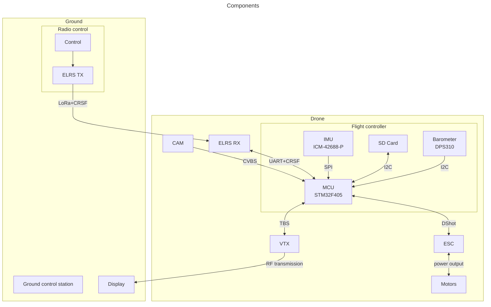

### Example on SpeedyBee F4V3

```mermaid
---
title: Components
---
flowchart TD
    subgraph Drone
        subgraph Flight controller
            MCU["`MCU
            STM32F405`"]
            IMU["`IMU
            ICM-42688-P`"]
            Barometer["`Barometer
            DPS310`"]

            sd_card["SD Card"]
            
            Barometer --I2C--> MCU
            sd_card <--I2C--> MCU
            IMU --SPI--> MCU 
        end
        VTX
        ELRS_RX["ELRS RX"]
        ESC
        Motors
        CAM
        MCU <--DShot--> ESC
        MCU <--TBS--> VTX
        ESC <--power output--> Motors
        ELRS_RX <--UART+CRSF--> MCU
        CAM --CVBS--> MCU
    end
    subgraph Ground
        ground_station["Ground control station"]
        subgraph Radio control
            control["Control"]
            ELRS_TX["ELRS TX"]
            control --> ELRS_TX
        end
        Display
    end
    ELRS_TX --LoRa+CRSF--> ELRS_RX
    VTX --RF transmission--> Display

```